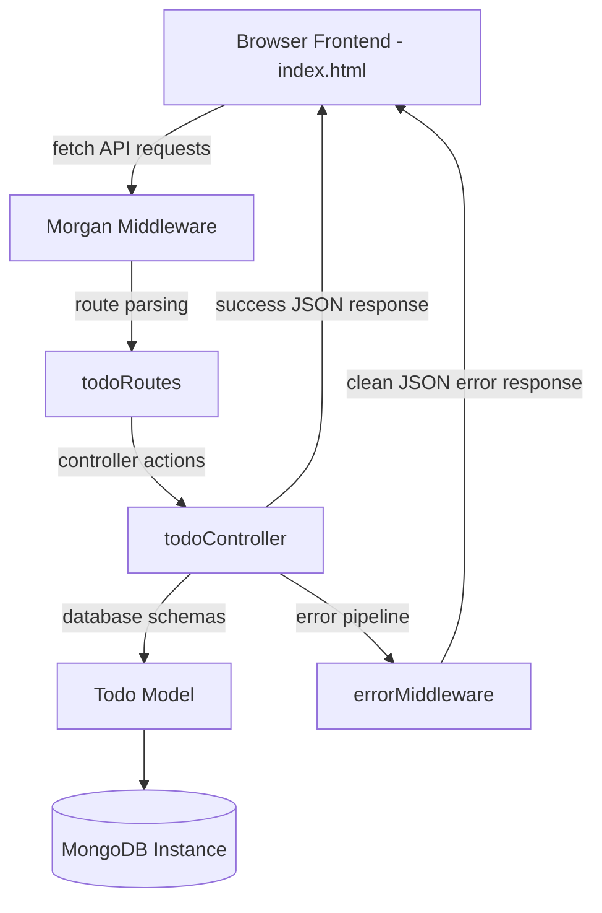

# ⚡ AuraTodo - Premium Full-Stack Glassmorphic Task Manager

A state-of-the-art full-stack Todo List application built on a robust Node.js, Express, and MongoDB backend and served with a high-aesthetic, ultra-premium glassmorphic front-end. The interface uses CSS backdrop filters, glowing animations, reactive statistics, responsive mobile cards, and instant asynchronous `fetch()` API linkages.

---

## 🎨 Architectural Highlights



---

## 📂 Project Architecture

```bash
internship/
├── src/
│   ├── config/
│   │   └── db.js                 # MongoDB connection & client configuration
│   ├── controllers/
│   │   └── todoController.js     # Core Todo CRUD controllers (Get, Create, Edit, Delete)
│   ├── middleware/
│   │   └── errorMiddleware.js    # Global centralized error & 404 handlers
│   ├── models/
│   │   └── Todo.js               # Todo Mongoose Schema with strict validation
│   ├── public/
│   │   └── index.html            # Premium glassmorphic interface with styles and scripts
│   ├── routes/
│   │   └── todoRoutes.js         # REST route configurations
│   ├── app.js                    # Express application and standard logging middleware
│   └── server.js                 # Sub-folder bootstrapper and unhandled rejection trap
├── .env                          # Local active environment keys (ignored by git)
├── .env.example                  # Template environment file
├── package.json                  # Dependencies configuration manifest
├── server.js                     # Root redirection bootstrapper
├── todo-api.postman_collection.json # Exported Postman/Bruno request collection
└── README.md                     # Current comprehensive operational guide
```

---

## ⚙️ Prerequisites and Setup

Verify that **Node.js** (v16.0+) and **MongoDB** are installed and running locally on your system.

### 1. Extract and Install Dependencies
Initialize package packages configured in the manifest:
```bash
npm install
```

### 2. Configure Environment Variables
Establish your local `.env` variables from the provided example template:
```bash
cp .env.example .env
```
Ensure your database URI is accurate inside `.env`:
```ini
PORT=5000
NODE_ENV=development
MONGO_URI=mongodb://127.0.0.1:27017/todo_db
```

---

## 🚀 Launching the Application

### Active Development Mode (Nodemon Hot Reloading)
```bash
npm run dev
```

### Production Mode
```bash
npm start
```

Once running, navigate to **[http://localhost:5000](http://localhost:5000)** in your web browser. The server automatically routes requests to your glassmorphic frontend interface!

---

## 📡 REST API Reference

All backend controllers are nested under the base routing path `/api/todos`:

| Method | Endpoint | Description | Query Parameters (Optional) |
| :--- | :--- | :--- | :--- |
| **GET** | `/health` | Server Health Status & Uptime | None |
| **GET** | `/api/todos` | Retrieve list of todos | `priority` (low/medium/high), `completed` (true/false) |
| **GET** | `/api/todos/:id` | Fetch single task by ID | None |
| **POST** | `/api/todos` | Add a new todo card | Request Body (JSON) |
| **PUT** | `/api/todos/:id` | Modify/Complete an existing todo | Request Body (JSON) |
| **DELETE** | `/api/todos/:id` | Remove a todo permanently | None |

---

## 🛠️ Data Schema & Validation Constraints

A `Todo` document in MongoDB is configured and strictly validated by Mongoose:

| Field Name | Type | Validation / Constraints | Description |
| :--- | :--- | :--- | :--- |
| `title` | String | Required, Trimmed, Max: 150 chars, Min: 1 char | Text header of task |
| `description`| String | Optional, Trimmed, Max: 500 chars, Default: `""`| Secondary description |
| `completed` | Boolean| Default: `false` | Marks completion state |
| `priority` | String | Enum validation (`low`, `medium`, `high`), Default: `medium` | Dynamic color indicators |
| `createdAt` | Date | Managed automatically via schema timestamps | Logging timestamp |

---

## 💎 Premium Frontend Features

The interactive client interface served by Express (`src/public/index.html`) is packed with top-tier visual and technical refinements:
- **Glassmorphic Glass Cards**: Backdrop-blur overlay configurations backed by semi-transparent background colors (`rgba`) and soft white borders.
- **Micro-Animations**: Slide-ins, floating blobs, scale transitions on button interactions, and strike-through checkmark animations.
- **Interactive Dashboard Statistics**: Top section displays Total, Pending, and Completed tallies in real-time.
- **Real-Time Progress Bar**: A visual progress bar that increases/decreases dynamically based on completed percentages.
- **Priority Indicators**: Colored border accents (Red for High, Orange for Medium, Emerald for Low).
- **Edit Modal**: Engaging overlay pop-up modal to update title, details, and priority values cleanly.
- **Custom Toasts System**: Seamless slide-in alert popups reporting success or failures without standard browser alerts.

---

## 📬 Postman Request Testing

1. Open **Postman** (or **Bruno**).
2. Click **Import** and select the [todo-api.postman_collection.json](./todo-api.postman_collection.json) file.
3. Use the preconfigured requests to test HTTP routes. The variables default to local port `5000` automatically.
